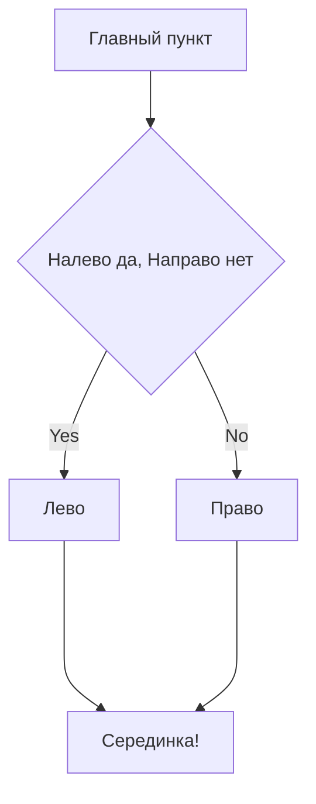

# git-hints

## Небольшой гит-репозиторий для самостоятельной работы

`git clone https://github.com/PraktikumJava/git-hints.git`

### Список команд для терминала
$ ls - показать содержимое директории
$ cd <directory> - перейти в другую директорию
$ cd .. - перейти в директорию выше
$ cd ~ - перейти в домашнюю директорию

### Список команд для git
$ git add  - добавить в staging area (staged + tracked)
$ git commit -m 'message'  - закоммитить, файл останется tracked
$ git status  - вывести статус гита, увидеть в каком состоянии находятся файлы

$ git commit --amend --no-edit  - дополнить последний коммит, --no-edit (не изменять сообщение коммита)
$ git commit --amend -m "Новое сообщение коммита" - дополнить последний коммит с изменением сообщения

$ git push --force  - УДАЛИТЬ ВСЕ КОММИТЫ И ЗАПУШИТЬ ТОЛЬКО ЭТОТ (полна потеря истории коммитов)
$ git reset --hard <hash>  - удаляет все коммиты до указанного, делая его последним (ОСТОРОЖНО, теряются все изменения)
$ git restore <file>  -- возвращает файл к последней версии (ОСТОРОЖНО, можно потерять важные изменения)

$ git diff  - Показывает изменения с указанием,с каких строк были изменения.
$ git diff <commit1> <commit2> - Показывает разницу между указанными коммитами

& git checkout -b <branch_name>  - создание новой ветки
& git checkout -b <branch_name>  - создание новой ветки и переход в нее

& git clone <URL>  - клонирует удаленный репозиторий(клонирует всё, но не создает ветки, чтобы их увидеть смотри ниже)
& git branch -a  - покажет все ветки репозитория (можно перейти по имени и локальная ветка будет создана из удаленной)

& git merge <branch_name>  - объединить две ветки (обычно к main мёржат другую ветку)
& git branch -D <branch_name>  - удалить ветку (обычно после мёржа удаляют присоединённую ветку)
⚠️ Удаление локальной ветки через Git не удаляет ветку на GitHub!

### Проверка работы mermaid схемы

