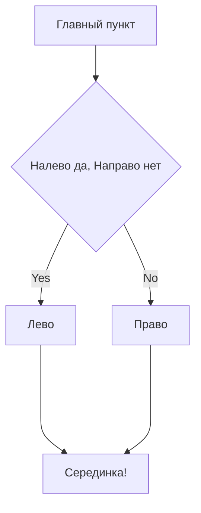

# git-hints

## Небольшой гит-репозиторий для самостоятельной работы

`git clone https://github.com/PraktikumJava/git-hints.git`

### Список команд для терминала
$ ls - показать содержимое директории
$ cd <directory> - перейти в другую директорию
$ cd .. - перейти в директорию выше
$ cd ~ - перейти в домашнюю директорию

### Список команд для git
$ git add  - добавить в staging area (staged + tracked)
$ git commit -m 'message'  - закоммитить, файл останется tracked
$ git status  - вывести статус гита, увидеть в каком состоянии находятся файлы
$ git commit --amend --no-edit  - дополнить последний коммит, --no-edit (не изменять сообщение коммита)
$ git commit --amend -m "Новое сообщение коммита" - дополнить последний коммит с изменением сообщения
$ git push --force  - УДАЛИТЬ ВСЕ КОММИТЫ И ЗАПУШИТЬ ТОЛЬКО ЭТОТ (полна потеря истории коммитов)

### Проверка работы mermaid схемы

